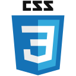

  

# Hey, I'm Haroon 👋

## About Me

Self-taught Full-Stack Developer with 2+ years of experience designing and building interactive websites and applications using React, TypeScript, and Tailwind Css. Driven by a passion for problem-solving and innovative solutions, with a strong focus on creating intuitive, user-centric projects and meticulous attention to detail.

## 🛠 Tech Stack

**Frontend**

    &nbsp;&nbsp;
    &nbsp;&nbsp;
    &nbsp;&nbsp;
    &nbsp;&nbsp;
    &nbsp;&nbsp;
    &nbsp;&nbsp;
    

**Backend**

    &nbsp;&nbsp;&nbsp;
    

**Database**

    

## Get in Touch

    &nbsp;&nbsp;
    

